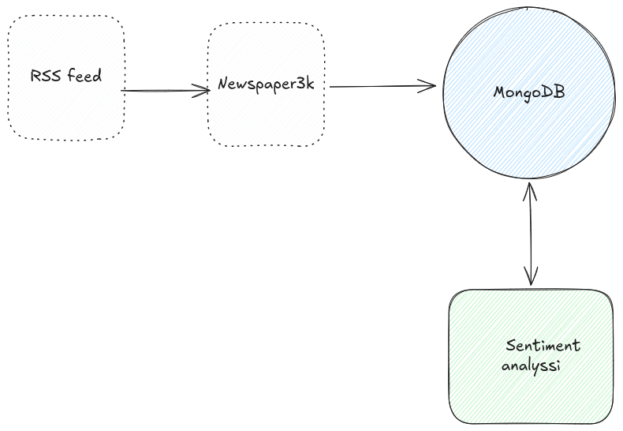

# Iran War Media Monitor

## Introduction 

This project monitors news coverage of the war between Iran, Israel, and the United States.

You can use this repository to:

1. Create a corpus of media articles in English
2. Identify authors and news media outlets to keep track of who says what and when
3. Sentiment analysis of articles to identify if an article supports the war, is factual and netural, or opposes the war.

## Data collection and processing

There are two workflows. 

First workflow runs the scraper that collects meta data and news articles from RSS feeds. The feed is set to Google RSS but you can change feed in rss.py.

Second workflow performs sentiment analysis on collected articles and upserts articles.

The project uses MongoDB to store articles. Use Docker to create an instance of MongoDB. 

## The scripts:

Run rss.py to get a list of the latest articles from RSS feed.

Run scraper.py to get urls from Google RSS and scrape the articles. 

Use sentiment.py to perform sentiment analysis on unprocessed articles. The process field is set to True when a document has received a sentiment score.

## Future improvements

1. Add the ability to scrape more RSS feeds
2. Custom model to identify relevancy of news articles for filtering purposes
3. Custom model to better predict tonality of articles (pro, opposed, factual)
4. Extract entities and relationships and who did what, when, where and to whom.
5. Generative AI analyses of the articles (both separate and of the whole corpus).
